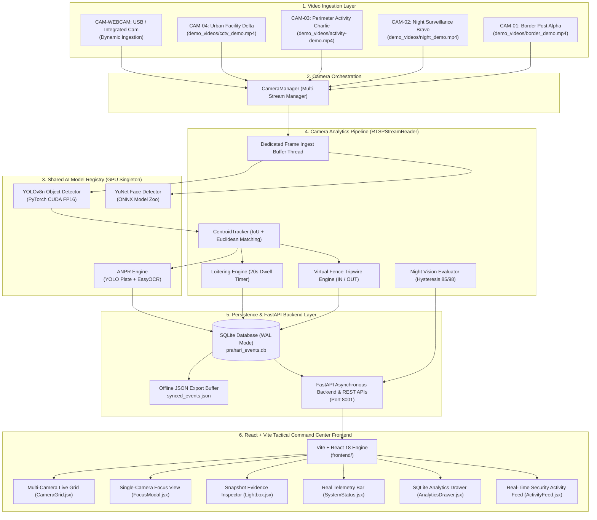
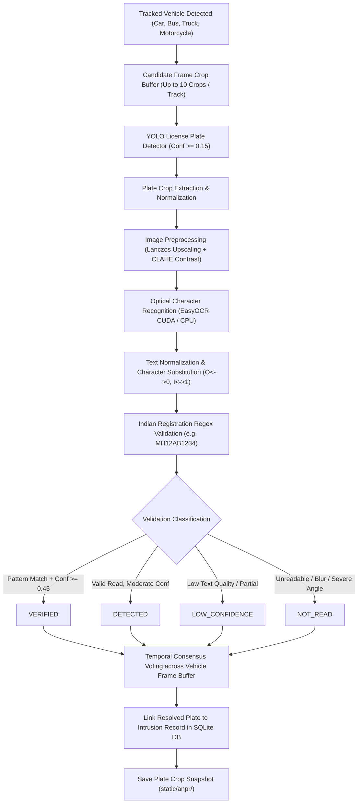

# PRAHARI-AI — Multi-Camera Intelligent Surveillance & Security Analytics Platform

> **Real-Time Edge AI Surveillance, Multi-Camera Stream Ingestion, Virtual Fence Perimeter Defense, Automated ANPR, Detection-Only Facial Analytics, Loitering Heuristics, Dual-Threshold Night Vision, and Offline-First Local Persistence.**

---

## Table of Contents

1. [Project Title & Identity](#1-project-title--identity)
2. [Project Overview](#2-project-overview)
3. [Problem Statement](#3-problem-statement)
4. [The PRAHARI-AI Solution](#4-the-prahari-ai-solution)
5. [Key Features](#5-key-features)
6. [System Architecture](#6-system-architecture)
7. [Frame Processing Lifecycle](#7-frame-processing-lifecycle)
8. [Camera Configuration](#8-camera-configuration)
9. [Object Detection & Vehicle Subtype Classification](#9-object-detection--vehicle-subtype-classification)
10. [Multi-Object Tracking Engine](#10-multi-object-tracking-engine)
11. [Virtual Fence & Perimeter Intrusion Detection](#11-virtual-fence--perimeter-intrusion-detection)
12. [Automatic Number Plate Recognition (ANPR Pipeline)](#12-automatic-number-plate-recognition-anpr-pipeline)
13. [Face Detection & Privacy Architecture](#13-face-detection--privacy-architecture)
14. [Suspicious Activity & Loitering Analytics](#14-suspicious-activity--loitering-analytics)
15. [Night Mode & Nocturnal Surveillance](#15-night-mode--nocturnal-surveillance)
16. [Shared GPU Model Registry Architecture](#16-shared-gpu-model-registry-architecture)
17. [Database Architecture & Offline Persistence](#17-database-architecture--offline-persistence)
18. [API Reference](#18-api-reference)
19. [Dashboard Guide & UI Features](#19-dashboard-guide--ui-features)
20. [Project Directory Structure](#20-project-directory-structure)
21. [Installation & Dependencies](#21-installation--dependencies)
22. [GPU & CUDA Acceleration Setup](#22-gpu--cuda-acceleration-setup)
23. [How to Run the Application](#23-how-to-run-the-application)
24. [Dynamic Webcam Guide](#24-dynamic-webcam-guide)
25. [Dashboard Telemetry Guide](#25-dashboard-telemetry-guide)
26. [Automated Test Suite & Verification](#26-automated-test-suite--verification)
27. [Performance & Measured Development Benchmarks](#27-performance--measured-development-benchmarks)
28. [Troubleshooting Guide](#28-troubleshooting-guide)
29. [Repository Hygiene & .gitignore Policy](#29-repository-hygiene--gitignore-policy)
30. [Team Member Quick Start](#30-team-member-quick-start)
31. [SIH Demonstration Flow](#31-sih-demonstration-flow)
32. [Known System Limitations](#32-known-system-limitations)
33. [Future Improvements & Roadmap](#33-future-improvements--roadmap)
34. [Privacy & Responsible AI Disclosure](#34-privacy--responsible-ai-disclosure)
35. [Contributing & Team Development Workflow](#35-contributing--team-development-workflow)
36. [Credits & Open Source Acknowledgments](#36-credits--open-source-acknowledgments)
37. [License](#37-license)

---

## 1. Project Title & Identity

- **Project Name**: PRAHARI-AI
- **Full Title**: PRAHARI-AI — Multi-Camera Intelligent Surveillance & Security Analytics Platform
- **GitHub Account**: `abhishek-khairnar`
- **Repository URL**: `https://github.com/abhishek-khairnar/PRAHARI-AI.git`
- **Branch**: `main`
- **Mission**: High-throughput, edge-accelerated, air-gapped perimeter security and automated video intelligence for forward operating locations, border checkpoints, high-security installations, and sensitive facility perimeters.

---

## 2. Project Overview

**PRAHARI-AI** (*Pra-ha-ri* — Sanskrit for *Sentinel / Guardian*) is a real-time, multi-camera video analytics and surveillance monitoring platform designed to transform passive security camera streams into an autonomous threat detection system.

In security operations, conventional CCTV networks require continuous human monitoring. As the number of camera channels increases, human operators face cognitive overload, leading to missed intrusions, delayed responses, and transcription errors during incident logging.

PRAHARI-AI addresses these challenges at the edge. The system concurrently ingests multiple video sources (RTSP streams, local surveillance video loops, and live USB/integrated webcams), passes frames through a shared GPU Model Registry, maintains persistent object tracking trajectories, enforces geometric virtual tripwires, flags dwell-time loitering, classifies day/night transitions using dual-threshold hysteresis, reads vehicle license plates (ANPR), and provides a low-latency web command center dashboard at `http://localhost:8001`.

---

## 3. Problem Statement

Perimeter defense and facility security operations contend with several operational vulnerabilities:

1. **Operator Fatigue**: Prolonged monitoring of multi-screen camera grids leads to rapid drops in human attention, increasing the likelihood of undetected boundary breaches.
2. **Passive Surveillance Disconnect**: Standard CCTV systems log footage passively for post-incident investigation rather than intercepting security threats in real time.
3. **Multi-Feed Scale**: Monitoring multiple independent channels simultaneously creates visual blind spots and delays emergency response times.
4. **Manual Checkpoint Bottlenecks**: Logging vehicle registration numbers manually at entry checkpoints is slow, error-prone, and unsustainable during peak volume.
5. **Nocturnal Vulnerabilities**: Low ambient lighting masks unauthorized human and vehicle movement near perimeter boundaries.
6. **Hardware Resource Constraints**: Running separate deep learning models per camera feed quickly exhausts GPU VRAM, limiting multi-camera scalability on edge hardware.

---

## 4. The PRAHARI-AI Solution

PRAHARI-AI resolves these security bottlenecks through an integrated edge software architecture:

- **Autonomous Multi-Camera Monitoring**: Concurrently ingests and analyzes 4 distinct surveillance feeds plus dynamic hardware webcam inputs without human intervention.
- **Active Real-Time Breach Alerting**: Computes exact centroid trajectories across virtual tripwire boundaries, classifies breach direction (`IN` vs `OUT`), and generates instant forensic evidence snapshots.
- **Shared Model Registry Architecture**: Employs a singleton memory pattern (`ModelRegistry`) ensuring that all camera threads share a single set of GPU model weights, keeping VRAM bounded.
- **Multi-Stage Security Intelligence**: Evaluates virtual fences, dwell-time loitering anchors, ambient luminance hysteresis, and vehicle license plate recognition concurrently.
- **Structured ANPR Verification**: Automatically localizes plates, performs contrast enhancement, extracts text via OCR, and validates against Indian vehicle registration standards.
- **Air-Gapped Local Resilience**: Operates 100% locally with an asynchronous SQLite Write-Ahead Logging (WAL) database and offline JSON export capabilities without cloud dependence.
- **Interactive Command Center**: Delivers low-latency MJPEG feeds, live telemetry cards, Focus View inspection, Lightbox evidence viewer, and real-time database analytics at `http://localhost:8001`.

---

## 5. Key Features

```text
┌────────────────────────────────────────────────────────────────────────────────────────┐
│                                PRAHARI-AI CORE CAPABILITIES                            │
├──────────────────────────┬──────────────────────────┬──────────────────────────────────┤
│ Multi-Camera Ingestion   │ Object Detection & Class │ Tracking & Virtual Fence         │
│ • 4 Core Surveillance    │ • YOLOv8n Deep Inference │ • Centroid + IoU Matching        │
│ • Dynamic USB/Webcam     │ • Person & Vehicle Types │ • Persistent Track IDs           │
│ • Independent Pipelines  │ • Car, Bus, Truck, Moto  │ • IN / OUT Direction Logic       │
├──────────────────────────┼──────────────────────────┼──────────────────────────────────┤
│ Automated ANPR Pipeline  │ Nocturnal Surveillance   │ Behavioral Analytics             │
│ • YOLO Plate Detector    │ • Luminance Measurement  │ • Dwell-Time Loitering Detection │
│ • EasyOCR Text Engine    │ • Dual-Threshold (85/98) │ • Spatial Anchor Radius (100px)  │
│ • 4 Validation Tiers     │ • Anti-Flicker State     │ • EMA Position Smoothing         │
├──────────────────────────┼──────────────────────────┼──────────────────────────────────┤
│ Detection-Only Faces     │ Shared GPU Architecture  │ Tactical Command Center          │
│ • YuNet ONNX Detector    │ • Singleton ModelWeights │ • Multi-Feed Grid & Focus View   │
│ • Amortized Inference    │ • Bounded GPU Footprint  │ • Lightbox Evidence Modal        │
│ • No Identity Storage    │ • Thread-Safe Execution  │ • Real SQLite Analytics Engine   │
└──────────────────────────┴──────────────────────────┴──────────────────────────────────┘
```

---

## 6. System Architecture

The following Mermaid diagram illustrates the actual codebase architecture of PRAHARI-AI:



---

## 7. Frame Processing Lifecycle

Every video frame processed by PRAHARI-AI passes through a deterministic sequence:

1. **Ingest & Grab**: The `RTSPStreamReader` grabber thread fetches frames from the camera or video file, maintaining a latest-frame buffer to drop stale frames if processing latency exceeds capture rate.
2. **Scene Luminance & Discontinuity Check**: Ambient luminance is calculated (grayscale mean + median) for night state evaluation. A 64x36 thumbnail difference check resets track states if video loop discontinuities occur.
3. **Deep Learning Inference**: The clean frame is sent to `ModelRegistry.yolo_model.predict()` under `yolo_infer_lock` to localize persons, vehicles, and subtypes.
4. **Amortized Face Detection**: Every 8th frame (`FACE_DETECTION_INTERVAL = 8`), person bounding boxes are cropped and passed to the YuNet face detector to count visible faces.
5. **Centroid & IoU Tracking**: Detection bounding boxes are passed to `CentroidTracker.update()`, associating detections with existing track IDs using IoU and centroid distance metrics.
6. **Virtual Fence Tripwire Check**: Centroid coordinates are checked against the camera's configured fence line ($Y$-ratio). Crossings determine breach direction (`IN` vs `OUT`).
7. **Behavioral Analysis**:
   - **Loitering**: Evaluates whether a tracked person has remained within a 100-pixel anchor radius for $\ge 20$ seconds.
   - **Night Motion**: Flags movement ($>15$ px displacement) occurring while the camera is confirmed in night mode.
8. **ANPR Queue & Extraction**: Vehicle detections sample high-sharpness crops into a rolling buffer. High-ranking crops are enqueued for asynchronous license plate localization and EasyOCR extraction.
9. **Snapshot & Database Persistence**: Intrusion events, ANPR plate reads, and security incidents generate annotated 1080p JPEG snapshots and are logged to `prahari_events.db` in SQLite WAL mode.
10. **MJPEG Transmission & Dashboard Render**: The annotated frame is JPEG-encoded and streamed to the browser command center interface at `http://localhost:8001`.

---

## 8. Camera Configuration

PRAHARI-AI is configured out-of-the-box with 4 core surveillance demo streams + 1 dynamic webcam channel:

| Camera ID | Camera Name | Source Type | Configured Video Path / Source | Default Fence Line ($Y$-Ratio) |
| :--- | :--- | :--- | :--- | :---: |
| **CAM-01** | Border Post Alpha | Video File Loop | `demo_videos/border_demo.mp4` | `0.70` (70% height) |
| **CAM-02** | Night Surveillance Bravo | Video File Loop | `demo_videos/night_demo.mp4` | `0.65` (65% height) |
| **CAM-03** | Perimeter Activity Charlie | Video File Loop | `demo_videos/activity-demo.mp4` | `0.60` (60% height) |
| **CAM-04** | Urban Facility Delta | Video File Loop | `demo_videos/cctv_demo.mp4` | `0.70` (70% height) |
| **CAM-WEBCAM** | Live Integrated / USB Webcam | Hardware Device | Device Index `0` (or selected index) | `0.70` (70% height) |

> [!IMPORTANT]
> The exact filename for CAM-03 is `demo_videos/activity-demo.mp4` (with a hyphen). Ensure this exact file name exists inside your `demo_videos/` directory.

---

## 9. Object Detection & Vehicle Subtype Classification

Object detection is powered by Ultralytics YOLOv8n (`yolov8n.pt`).

### Supported Target Classes
- **Person**: Class ID `0`
- **Vehicle (Generic)**: Class ID `1`
- **Car**: Class ID `2`
- **Motorcycle**: Class ID `3`
- **Bus**: Class ID `5`
- **Truck**: Class ID `7`

### Subtype Classification Threshold
Vehicle detections are classified into detailed subtypes (Car, Motorcycle, Bus, Truck) when confidence exceeds `VEHICLE_SUBTYPE_CONFIDENCE_THRESHOLD = 0.40`. Otherwise, they are categorized under generic `Vehicle`.

### Processed-Frame Telemetry Format
Camera cards display live object counts formatted as:
```text
Objects: TOTAL (PERSON_COUNT P, VEHICLE_COUNT V)
```
*Example*: `Objects: 15 (9P, 6V)` indicates 15 total objects detected in the current processed frame (9 Persons, 6 Vehicles). These numbers represent valid current-frame detections, distinct from historical tracker totals.

---

## 10. Multi-Object Tracking Engine

Object tracking is implemented in `centroid_tracker.py` (`CentroidTracker`):

1. **IoU Association**: Detection bounding boxes are first associated with existing active tracks using Intersection-over-Union (IoU) overlap matching.
2. **Euclidean Centroid Distance**: Unmatched detections fall back to pairwise Euclidean distance matching between track centroids and new detection centroids.
3. **Persistent Track IDs**: Objects retain a persistent integer track ID (`ID #1`, `ID #2`, etc.) across consecutive frames.
4. **Trajectory Buffer**: Maintains a history of recent centroid positions to establish direction vectors.
5. **Deregistration Guard**: Objects missing for more than `max_disappeared = 30` consecutive frames are safely removed from active memory.
6. **Loop Discontinuity Handling**: Scene changes or video loop restarts trigger `tracker.reset()`, preventing artificial velocity spikes across loop boundaries.

---

## 11. Virtual Fence & Perimeter Intrusion Detection

The virtual fence operates as a geometric tripwire across the camera field of view:

```text
Tracked Object Approaches Fence Line (Y = Line_Y_Ratio * Frame_Height)
            │
            ▼
    Track Centroid Trajectory Buffer Maintained
            │
            ▼
Centroid Crosses Virtual Fence Line Coordinate
            │
            ▼
Direction Evaluated: Previous Y Position vs. Current Y Position
            ├── Moved Downward (Y_prev < Line < Y_curr) ──► Direction = "IN"
            └── Moved Upward   (Y_prev > Line > Y_curr) ──► Direction = "OUT"
            │
            ▼
Duplicate Alert Suppression (Per-Track Cooldown Check)
            │
            ▼
Intrusion Event Generated:
  • Full-resolution annotated JPEG snapshot (static/alerts/intrusion_<ts>_id<id>.jpg)
  • Bounding box overlay, centroid point, fence line, direction badge, telemetry banner
  • Relational database insertion into intrusion_events table
  • Real-time alert card broadcast to live dashboard feed
```

---

## 12. Automatic Number Plate Recognition (ANPR Pipeline)

PRAHARI-AI implements a multi-stage ANPR pipeline:



### ANPR Validation Categories

- **`VERIFIED`**: The recognized plate string matches standard Indian registration syntax (e.g., `MH02FU9304`) with high OCR confidence ($\ge 0.45$).
- **`DETECTED`**: The plate was successfully localized and read, but contains minor non-standard formatting or moderate confidence.
- **`LOW_CONFIDENCE`**: Characters were extracted, but overall confidence fell below the operational threshold.
- **`NOT_READ`**: The license plate is unreadable due to severe blur, low resolution, extreme angle, or occlusion. Unreadable plates are reported honestly as `NOT_READ` without hallucinating fake text or displaying `NaN%` confidence.

---

## 13. Face Detection & Privacy Architecture

Facial analytics are powered by the **YuNet ONNX** model (`weights/face_detection_yunet_2023mar.onnx`):

- **Inference Execution**: Executed via OpenCV DNN (`cv2.FaceDetectorYN`) on cropped head/upper-body regions of detected persons.
- **Amortized Frequency**: Evaluated every 8th frame (`FACE_DETECTION_INTERVAL = 8`) to maintain sub-2 ms amortized latency.
- **Telemetry Counter**: Computes per-camera visible face counts and a system-wide `Total Live Faces` header metric.
- **Responsible AI & Privacy Guarantee**:
  - Face detection is strictly **detection-only** (identifying bounding box coordinates).
  - The system performs **no facial recognition** and **no identity matching**.
  - **No biometric database** or facial embeddings are created, indexed, or stored.

---

## 14. Suspicious Activity & Loitering Analytics

The loitering engine detects stationary targets within designated perimeter zones:

- **Anchor Position**: Establishes a spatial anchor coordinate when a person track is first registered.
- **Dwell Time Threshold**: Triggers a loitering alert if a person remains within a `LOITERING_RADIUS_PIXELS = 100` radius for `LOITERING_TIME_SECONDS = 20` seconds.
- **Persistence Filter**: Requires `LOITERING_MIN_HITS = 10` consecutive detection frames before evaluating dwell timers.
- **Exponential Moving Average (EMA)**: Applies position smoothing (`0.95 * anchor + 0.05 * current`) to resist bounding box jitter.
- **Alert Cooldown**: Enforces `LOITERING_ALERT_COOLDOWN_SECONDS = 30` seconds per track ID.
- **Database Persistence**: Logs loitering incidents into the SQLite `security_events` table under `event_type = 'suspicious_activity'`.

---

## 15. Night Mode & Nocturnal Surveillance

Low-light surveillance relies on dual-threshold ambient luminance hysteresis:

- **Luminance Measurement**: Calculated using the combined mean and median pixel intensity of the grayscale frame thumbnail ($0.0–255.0$).
- **Dual-Threshold Hysteresis**:
  - **`NIGHT_ENTER_THRESHOLD = 85.0`**: Ambient luminance dropping $\le 85.0$ transitions the camera into `NIGHT` mode.
  - **`NIGHT_EXIT_THRESHOLD = 98.0`**: Ambient luminance rising $\ge 98.0$ transitions the camera into `DAY` mode.
- **Rolling History Window**: Evaluates luminance over a 15-frame rolling history buffer (`night_brightness_history` deque, `maxlen=15`).
- **Anti-Flicker Stability**: The 13-point hysteresis gap prevents DAY/NIGHT state oscillation caused by vehicle headlights or cloud shadows.
- **Nocturnal Motion Alerts**: Movement detected during active night state ($>15$ px centroid displacement) logs a `night_movement` security event.
- **Per-Camera Isolation**: Night state is evaluated independently for each camera channel.

---

## 16. Shared GPU Model Registry Architecture

To run multiple camera streams on constrained hardware without exhausting GPU memory, PRAHARI-AI uses a thread-safe Singleton `ModelRegistry` in `rtsp_stream.py`:

```text
┌────────────────────────────────────────────────────────────────────────────────────────┐
│                               MODELREGISTRY (SINGLETON)                                │
│                                                                                        │
│   ┌────────────────────────┐  ┌─────────────────────────┐  ┌────────────────────────┐  │
│   │ YOLOv8n (CUDA FP16)    │  │ YuNet Face Detector     │  │ ANPR Engine            │  │
│   │ yolo_infer_lock (Lock) │  │ face_infer_lock (Lock)  │  │ (YOLO Plate + EasyOCR) │  │
│   └───────────┬────────────┘  └────────────┬────────────┘  └───────────┬────────────┘  │
└───────────────┼────────────────────────────┼───────────────────────────┼───────────────┘
                ▲                            ▲                           ▲
                │ Shared Access              │ Shared Access             │ Shared Access
   ┌────────────┴───────────┬────────────────┴───────────┬───────────────┴───────────┐
   │                        │                            │                           │
┌──┴────────────────┐ ┌─────┴──────────────┐ ┌───────────┴────────┐ ┌────────────────┴───┐
│ CAM-01 Reader     │ │ CAM-02 Reader      │ │ CAM-03 Reader      │ │ CAM-04 / CAM-WEBCAM │
│ (Border Alpha)    │ │ (Night Bravo)      │ │ (Perimeter Charlie)│ │ (Delta & Webcam)    │
└───────────────────┘ └────────────────────┘ └────────────────────┘ └─────────────────────┘
```

- **Single Weight Allocation**: YOLOv8n, YuNet ONNX, and ANPR model weights are loaded once upon server initialization.
- **Mutex Inference Locks**: Camera threads request model inference under thread locks (`yolo_infer_lock`, `face_infer_lock`).
- **Memory Isolation vs. State Isolation**: AI weights are shared centrally, while camera trajectories, tracking IDs, loitering anchors, and night states remain isolated per stream.

---

## 17. Database Architecture & Offline Persistence

All security events and telemetry records are persisted locally in `prahari_events.db` using SQLite Write-Ahead Logging:

```text
PRAGMA journal_mode=WAL;
PRAGMA synchronous=NORMAL;
```

### Relational Schema

1. **`intrusion_events`**: Stores virtual fence breach records (`id`, `timestamp`, `camera_id`, `object_type`, `object_id`, `direction`, `plate_text`, `plate_confidence`, `anpr_status`, `validation_status`, `snapshot_path`, `synced`).
2. **`anpr_events`**: Stores license plate reads (`id`, `timestamp`, `camera_id`, `object_type`, `object_id`, `plate_text`, `confidence`, `validation_status`, `snapshot_path`, `synced`).
3. **`security_events`**: Stores loitering, night motion, and general security incidents (`id`, `timestamp`, `camera_id`, `event_type`, `object_type`, `object_id`, `confidence`, `validation_status`, `snapshot_path`, `details`, `synced`).
4. **`system_events`**: Tracks system lifecycle milestones (startup, camera disconnects, sync batches).

### Optimized Composite Indexes
- `idx_intrusion_cam` on `intrusion_events(camera_id, timestamp DESC)`
- `idx_anpr_cam` on `anpr_events(camera_id, timestamp DESC)`
- `idx_security_cam` on `security_events(camera_id, timestamp DESC)`
- `idx_intrusion_synced` on `intrusion_events(synced)`

### Offline-First Synchronization
An offline sync engine exports all unsynced records (`synced = 0`) into `synced_events.json` upon request, enabling field units to archive surveillance data without continuous network access.

---

## 18. API Reference

| Method | Endpoint | Description | Query / Body Parameters |
| :--- | :--- | :--- | :--- |
| `GET` | `/` | Serves Command Center web interface | None |
| `GET` | `/video_feed` | MJPEG stream for default camera | `camera_id` (optional, defaults to CAM-01) |
| `GET` | `/video_feed/{camera_id}` | Dedicated MJPEG video stream for a specific camera | `camera_id` (`CAM-01`, `CAM-02`, `CAM-WEBCAM`, etc.) |
| `GET` | `/api/cameras` | List of active cameras with telemetry & status | None |
| `GET` | `/api/status` | System metrics + primary camera telemetry | `camera_id` (optional) |
| `GET` | `/api/status/{camera_id}` | Detailed status for a single camera | `camera_id` |
| `GET` | `/api/dashboard_stats` | Consolidated payload for dashboard polling | Aggregate status, camera status, night/face stats |
| `GET` | `/api/alerts` | Recent virtual fence intrusion alerts | `camera_id` (optional), `limit` (default: 50) |
| `GET` | `/api/anpr_log` | Recent ANPR license plate reads | `camera_id` (optional), `limit` (default: 50) |
| `GET` | `/api/anpr_debug` | Candidate license plate debug crop metadata | `camera_id` (optional), `limit` (default: 50) |
| `GET` | `/api/security_events` | Security events (loitering, night motion) | `event_type`, `camera_id`, `limit` (default: 50) |
| `GET` | `/api/suspicious_alerts` | Recent suspicious activity / loitering alerts | `camera_id` (optional) |
| `GET` | `/api/night_status` | Current night mode state and brightness | `camera_id` (optional) |
| `GET` | `/api/face_stats` | Face detection statistics | `camera_id` (optional) |
| `GET` | `/api/analytics` | Real-time SQL aggregate analytics summary | Camera breakdown, hourly distribution, verified plates |
| `GET` | `/api/events/all` | Paginated historical events query | `limit`, `offset`, `camera_id` |
| `GET` | `/api/sync_status` | Offline-first sync metrics & pending count | None |
| `GET` | `/api/webcams/available` | Probes system for connected USB/webcams | Returns `[{"index": 0, "name": ...}]` |
| `GET`/`POST`| `/api/webcam/start` | Starts USB / integrated webcam as `CAM-WEBCAM` | `device_index` (default: 0) |
| `GET`/`POST`| `/api/webcam/stop` | Stops and disconnects `CAM-WEBCAM` | Returns `{"status": "stopped"}` |

---

## 19. Dashboard Guide & UI Features

The Command Center interface is served at `http://localhost:8001`:

```text
┌────────────────────────────────────────────────────────────────────────────────────────┐
│ PRAHARI-AI COMMAND CENTER                            [Connect Webcam]  [Analytics] 23:00│
├───────────────┬───────────────┬────────────────┬────────────────┬──────────────────────┤
│ ACTIVE FEEDS  │ LIVE FACES    │ VERIFIED ANPR  │ SECURITY INC.  │ GPU TELEMETRY        │
│ 4 Streams     │ 2 Detected    │ 8 Verified     │ 14 Breaches    │ RTX 3050 (24.1% VRAM)│
├───────────────┴───────────────┴────────────────┴────────────────┴──────────────────────┤
│ MULTI-CAMERA SURVEILLANCE GRID                                                         │
│ ┌──────────────────────────┐ ┌──────────────────────────┐                              │
│ │ CAM-01 Border Post Alpha │ │ CAM-02 Night Surveillance│                              │
│ │ [LIVE] [DAY] [FPS: 28.5] │ │ [LIVE] [NIGHT] [FPS:29.1]│                              │
│ │ Objects: 15 (9P, 6V)     │ │ Objects: 3 (1P, 2V)      │                              │
│ │ [Focus View]             │ │ [Focus View]             │                              │
│ └──────────────────────────┘ └──────────────────────────┘                              │
│ ┌──────────────────────────┐ ┌──────────────────────────┐                              │
│ │ CAM-03 Perimeter Activity│ │ CAM-04 Urban Facility    │                              │
│ │ [LIVE] [DAY] [FPS: 27.8] │ │ [LIVE] [DAY] [FPS: 28.0] │                              │
│ │ Objects: 4 (4P, 0V)      │ │ Objects: 8 (3P, 5V)      │                              │
│ │ [Focus View]             │ │ [Focus View]             │                              │
│ └──────────────────────────┘ └──────────────────────────┘                              │
├────────────────────────────────────────────────────────────────────────────────────────┤
│ LIVE INCIDENTS FEED                                                                    │
│ [All Events]  [Intrusions]  [ANPR Reads]  [Suspicious Activity]                        │
│ • 22:44:12 [CAM-01] INTRUSION: ID #4 Car crossed fence [IN]          [View Evidence]   │
│ • 22:43:50 [CAM-01] ANPR: Plate MH02FU9304 Verified (74%)            [Inspect Crop]    │
│ • 22:42:15 [CAM-03] SUSPICIOUS: ID #2 Loitering detected (>20s)       [View Evidence]   │
└────────────────────────────────────────────────────────────────────────────────────────┘
```

- **Top Metrics Bar**: Real-time summary counters for active feeds, visible face counts, verified ANPR reads, active security incidents, GPU memory consumption, and aggregate AI FPS.
- **Camera Cards**: Live MJPEG video stream, status badge (`LIVE`), Day/Night pill, face counter, AI/Capture FPS, and live object breakdown (`Objects: TOTAL (P, V)`).
- **Focus View Modal**: Expands any camera into a high-definition single-stream view with full telemetry overlay.
- **Lightbox Evidence Modal**: Displays full-resolution evidence snapshots with annotated fence lines, bounding boxes, and timestamps upon clicking any incident.
- **Analytics Modal**: Queries the SQLite database in real time to render event breakdowns per camera and hourly incident distributions.

---

## 20. Project Directory Structure

```text
PRAHARI-AI/
│
├── main.py                     # FastAPI application server, routing & MJPEG streaming
├── camera_manager.py           # Multi-camera configuration & dynamic webcam manager
├── rtsp_stream.py              # Core RTSPStreamReader, ModelRegistry & AI pipelines
├── centroid_tracker.py         # Multi-object centroid & IoU tracking engine
├── anpr_engine.py              # License plate detection, OCR & validation pipeline
├── database.py                 # SQLite WAL database manager & analytics engine
│
├── frontend/                   # React + Vite Tactical Command Center Frontend
│   ├── package.json            # Node.js dependencies & build scripts
│   ├── vite.config.js          # Vite development proxy configuration
│   ├── index.html              # HTML entry point template
│   └── src/
│       ├── main.jsx            # React root application bootstrap
│       ├── App.jsx             # Main dashboard orchestrator & state manager
│       ├── components/
│       │   ├── Header.jsx          # Branding, threat level & action controls
│       │   ├── SystemStatus.jsx    # Top KPI summary cards
│       │   ├── CameraGrid.jsx      # Multi-feed responsive grid
│       │   ├── CameraCard.jsx      # Individual camera feed card
│       │   ├── CameraStream.jsx    # MJPEG stream rendering component
│       │   ├── ActivityFeed.jsx    # Live incident feed & tabs
│       │   ├── FocusModal.jsx      # Single-camera focus view inspection modal
│       │   ├── Lightbox.jsx        # Snapshot evidence preview modal
│       │   └── AnalyticsDrawer.jsx # SQLite analytics drawer modal
│       ├── hooks/
│       │   └── usePolling.js       # Controlled request-safe polling hook
│       ├── services/
│       │   └── api.js              # FastAPI REST service client
│       └── styles/
│           └── globals.css         # Command center design system & styling
│
├── demo_videos/                # Pre-configured surveillance video feeds
│   ├── border_demo.mp4         # CAM-01: Border Post Alpha
│   ├── night_demo.mp4          # CAM-02: Night Surveillance Bravo
│   ├── activity-demo.mp4       # CAM-03: Perimeter Activity Charlie
│   └── cctv_demo.mp4           # CAM-04: Urban Facility Delta
│
├── weights/                    # AI model weights
│   ├── yolov8n.pt              # YOLOv8 nano object detector
│   └── face_detection_yunet_2023mar.onnx # YuNet face detection ONNX model
│
├── tests/                      # Automated test suite
│   └── test_full_suite.py      # Full system integration & unit test suite
│
├── static/                     # Snapshot evidence output directories
│   ├── alerts/                 # Intrusion evidence snapshots (.gitkeep)
│   ├── anpr/                   # License plate evidence snapshots (.gitkeep)
│   └── anpr_debug/             # Debug plate localization crops (.gitkeep)
│
├── start_prahari.bat           # One-click Windows batch launcher
├── start_prahari.ps1           # Windows PowerShell launcher
├── requirements.txt            # Python package dependencies
├── .gitignore                  # Git repository exclusion rules
└── README.md                   # Complete system documentation
```

---

## 21. Installation & Dependencies

### Prerequisites
- **OS**: Windows 10/11 (or Linux / macOS)
- **Python**: Version `3.10`, `3.11`, or `3.12` (Python 3.11 recommended)
- **Hardware**: NVIDIA GPU with CUDA support recommended (CPU fallback supported)

### Step 1: Clone Repository
```bash
git clone https://github.com/abhishek-khairnar/PRAHARI-AI.git
cd PRAHARI-AI
```

### Step 2: Create Virtual Environment

**Windows (PowerShell)**:
```powershell
python -m venv venv
.\venv\Scripts\Activate.ps1
```

**Windows (Command Prompt)**:
```cmd
python -m venv venv
venv\Scripts\activate.bat
```

**Linux / macOS**:
```bash
python3 -m venv venv
source venv/bin/activate
```

### Step 3: Install Dependencies
```bash
pip install -r requirements.txt
```

---

## 22. GPU & CUDA Acceleration Setup

PRAHARI-AI detects and utilizes CUDA GPU acceleration automatically.

### Check CUDA Status
Run this Python command to verify your GPU setup:
```bash
python -c "import torch; print(f'CUDA Available: {torch.cuda.is_available()} | Device: {torch.cuda.get_device_name(0) if torch.cuda.is_available() else \"CPU Fallback\"}')"
```

### Installing PyTorch with CUDA
If PyTorch defaults to CPU, install the appropriate CUDA wheel:
```bash
# For CUDA 12.1
pip install torch torchvision --index-url https://download.pytorch.org/whl/cu121

# For CUDA 11.8
pip install torch torchvision --index-url https://download.pytorch.org/whl/cu118
```

---

## 23. How to Run the Application

PRAHARI-AI supports both direct production execution (FastAPI static serving at `http://localhost:8001`) and Vite hot-reloading development execution.

### Production / Demo Launcher (Single Dashboard Endpoint)

Build the React frontend static assets:
```bash
cd frontend
npm install
npm run build
cd ..
```

Then start the application backend:
```bash
python main.py
```
Open `http://localhost:8001` in your browser. FastAPI automatically mounts `frontend/dist` and serves the production React command center.

Alternatively, use the automated launchers:
- **Windows Batch**: `start_prahari.bat`
- **PowerShell**: `.\start_prahari.ps1`

### Development Setup (Hot-Reloading)

**Terminal 1 — FastAPI Backend**:
```bash
python main.py
```

**Terminal 2 — React + Vite Development Server**:
```bash
cd frontend
npm install
npm run dev
```
Open `http://localhost:5173`. Vite proxies `/api`, `/video_feed`, `/alerts`, and `/anpr` seamlessly to the FastAPI backend running on port 8001.

---

## 24. Dynamic Webcam Guide

1. Launch PRAHARI-AI and open `http://localhost:8001`.
2. Click **"Connect Webcam"** in the top navigation bar.
3. The UI queries `/api/webcams/available` and lists connected camera devices.
4. Select the device index (e.g. Device #0) and click **Connect**.
5. The `CAM-WEBCAM` card initializes in the grid, running AI object detection, face counting, and virtual fence tracking on the live feed.
6. Click **Focus View** on `CAM-WEBCAM` for single-stream monitoring.
7. Click **"Disconnect Webcam"** to release hardware resources safely without stopping the server.

---

## 25. Dashboard Telemetry Guide

- **AI FPS**: Rate at which deep learning inference and tracking execute per second for a feed.
- **Capture FPS**: Raw video frame capture rate from the source stream.
- **Objects: TOTAL (XP, YV)**: Active object breakdown in the current processed frame ($X$ Persons, $Y$ Vehicles).
- **Faces**: Number of visible faces localized by YuNet in the current scene.
- **DAY / NIGHT State**: Ambient lighting classification based on 15-frame rolling hysteresis.
- **Threat Level**: System threat indicator computed from active intrusions and loitering events.

---

## 26. Automated Test Suite & Verification

The repository includes a full automated test suite in `tests/test_full_suite.py`.

### Run Automated Tests
```bash
python tests/test_full_suite.py
```

### Verified Test Coverage
- `test_database_connection_and_wal`: Confirms SQLite connection and WAL journal mode.
- `test_log_and_query_events`: Verifies intrusion and ANPR database logging and querying.
- `test_analytics_summary`: Validates live SQL aggregate calculations.
- `test_singleton_identity`: Confirms that `ModelRegistry` maintains a single memory instance across camera threads.
- `test_camera_list`: Verifies that all 4 core cameras are registered and formatted correctly.
- `test_get_reader`: Tests retrieval of individual camera stream reader instances.
- `test_night_thresholds`: Validates dual-threshold hysteresis values (`85.0` enter, `98.0` exit).
- `test_all_endpoints`: Executes integration requests against all major FastAPI endpoints.

---

## 27. Performance & Measured Development Benchmarks

The following benchmarks were measured on a development workstation:

| Performance Metric | Measured Development Workstation Specification |
| :--- | :--- |
| **Test Environment** | NVIDIA GeForce RTX 3050 (6GB VRAM Laptop GPU) / Intel Core CPU / 16GB RAM |
| **Operating System** | Windows 11 / Python 3.11.9 / PyTorch 2.5.1+cu121 |
| **GPU Memory Footprint** | ~724 MB VRAM total across all 4 concurrent camera pipelines |
| **Aggregate AI Throughput** | ~43.4 aggregate AI FPS (~10.8 AI FPS per camera feed) |
| **Video Ingestion Rate** | ~28–30 Capture FPS across all 4 streams |
| **YOLOv8n Inference Time** | ~8–15 ms per frame on CUDA (FP16) |
| **YuNet Face Detection** | <2 ms amortized latency (evaluated every 8 frames) |
| **Database Write Latency** | <1 ms (SQLite WAL mode with background connection locks) |

> [!NOTE]
> Performance metrics represent development machine measurements. Actual performance depends on host GPU/CPU hardware, video resolution, active AI modules, and stream count.

---

## 28. Troubleshooting Guide

| Issue | Potential Cause | Resolution |
| :--- | :--- | :--- |
| **CUDA Not Detected (Running on CPU)** | PyTorch CPU-only wheel installed | Reinstall PyTorch with CUDA index URL: `pip install torch torchvision --index-url https://download.pytorch.org/whl/cu121` |
| **Video File Not Found** | Missing file or incorrect filename | Ensure all 4 demo videos exist in `demo_videos/`. Verify CAM-03 is named `activity-demo.mp4` (with a hyphen). |
| **Port 8001 Already in Use** | Another process is occupying port 8001 | Terminate the occupying process or set custom port: `set PORT=8002 && python main.py` |
| **Webcam Fails to Open** | Camera in use by another app (Zoom/Teams) | Close other applications accessing the webcam and retry. |
| **Missing Python Dependencies** | Virtual environment not activated | Activate virtual environment and run `pip install -r requirements.txt`. |
| **Slow Stream in Browser** | High resolution or CPU inference bottleneck | Ensure CUDA is enabled; reduce browser rendering zoom or check system CPU/GPU utilization in Task Manager. |
| **ANPR Shows `NOT_READ`** | Plate is heavily blurred, distant, or angled | Expected behavior; PRAHARI-AI honestly marks unreadable plates as `NOT_READ` rather than hallucinating text. |
| **Database File Locked** | Non-WAL SQLite mode or external process lock | Ensure database initializes with WAL mode (`PRAGMA journal_mode=WAL;`). Restart server if lock persists. |

---

## 29. Repository Hygiene & .gitignore Policy

To prevent committing runtime surveillance data and temporary files, the following artifacts are excluded from version control:

- **Runtime Databases**: `*.db`, `*.db-wal`, `*.db-shm`, `*.db-journal`, `db_backups/`.
- **Runtime Generated Snapshots**: `static/alerts/*`, `static/anpr/*`, `static/anpr_debug/*` (directories are retained in git via `.gitkeep`).
- **Offline Sync Exports**: `synced_events.json`.
- **Python Cache & Virtual Environments**: `__pycache__/`, `*.pyc`, `.venv/`, `venv/`, `env/`.
- **Temporary & Scratch Files**: `scratch/`, `.system_generated/`, `*.tmp`.
- **External Binaries & Non-Production Models**: `mediamtx/`, `ffmpeg/`, `test.mp4`, `yolov8s.pt`, `weights/best.pt`.
- **Auto-Generated Certificates**: `auto.crt`, `auto.key`, `*.crt`, `*.key`.

---

## 30. Team Member Quick Start

1. Clone the repository: `git clone https://github.com/abhishek-khairnar/PRAHARI-AI.git`
2. Change directory: `cd PRAHARI-AI`
3. Activate virtual environment: `.\venv\Scripts\Activate.ps1` (or create via `python -m venv venv`).
4. Install requirements: `pip install -r requirements.txt`.
5. Verify demo files exist in `demo_videos/` and weights exist in `weights/`.
6. Run tests: `python tests/test_full_suite.py`.
7. Start server: `start_prahari.bat` or `python main.py`.
8. Open browser: `http://localhost:8001`.

---

## 31. SIH Demonstration Flow

Recommended 12-step presentation flow for judges and evaluators:

1. **Step 1 — Launch System**: Execute `start_prahari.bat` and highlight console logs showing CUDA GPU initialization and 4 camera stream registrations.
2. **Step 2 — Present Grid View**: Open `http://localhost:8001` to display all 4 live feeds operating concurrently.
3. **Step 3 — Explain Live Telemetry**: Point out `Objects: TOTAL (XP, YV)` on camera cards, explaining current-frame detection breakdown (Persons vs. Vehicles).
4. **Step 4 — Virtual Fence Intrusion**: Observe vehicles crossing the red tripwire line, generating instant `[IN]` or `[OUT]` breach alerts.
5. **Step 5 — Evidence Lightbox**: Click an incident thumbnail to view the full-resolution evidence snapshot with annotated fence line, bounding box, and telemetry header.
6. **Step 6 — Demonstrate ANPR**: Showcase the ANPR feed showing recognized plates (e.g. `MH02FU9304`), confidence percentage, and validation status (`VERIFIED`).
7. **Step 7 — Night Mode Analytics**: Point out CAM-02 (*Night Surveillance Bravo*) operating under purple `[NIGHT]` state with dual-threshold hysteresis ($85.0 / 98.0$).
8. **Step 8 — Suspicious Activity / Loitering**: Show CAM-03 (*Perimeter Activity Charlie*) where stationary entities trigger loitering alerts after 20 seconds.
9. **Step 9 — Detection-Only Face Counter**: Highlight `Total Live Faces` in the header bar and explain the privacy-preserving, detection-only architecture.
10. **Step 10 — Dynamic Webcam**: Click **"Connect Webcam"**, start the live camera as `CAM-WEBCAM`, and show immediate AI tracking.
11. **Step 11 — Focus View**: Expand any camera feed into single-stream Focus View for high-definition monitoring.
12. **Step 12 — SQL Analytics**: Click **"Analytics"** to display real-time event charts queried directly from SQLite.

---

## 32. Known System Limitations

1. **Serialized Shared Inference**: The shared `ModelRegistry` serializes GPU inference passes across camera threads using mutex locks. Scaling to 8+ concurrent streams on a single GPU may require batched inference.
2. **Video Loop Resets**: Active tracking IDs reset when demo video files loop to prevent artificial velocity vectors across loop boundaries.
3. **Severe Optical Distortion**: Extremely distant, blurred, or angled license plates are marked as `NOT_READ` to avoid false text recognition.
4. **Webcam Device Access**: Webcam availability depends on host OS camera permissions and hardware driver availability.

---

## 33. Future Improvements & Roadmap

- [ ] **Batched Tensor Inference**: Asynchronous dynamic tensor batching across multi-stream inputs to scale to 16+ cameras per GPU.
- [ ] **Custom Vehicle Model**: Fine-tuned weights on Indian traffic datasets to distinguish 3-wheelers (auto-rickshaws) and agricultural tractors.
- [ ] **Edge Containerization**: Containerized builds tailored for NVIDIA Jetson Orin Nano / Xavier NX edge devices.
- [ ] **Alert Webhooks**: Automated webhook dispatch for Telegram, SMS, and secure SMTP email notifications upon critical breaches.
- [ ] **PTZ Camera Tracking**: Integration with ONVIF PTZ camera controls for automated zoom-in tracking.

---

## 34. Privacy & Responsible AI Disclosure

- **Detection-Only Architecture**: Face detection in PRAHARI-AI is strictly detection-only (identifying bounding boxes in the frame).
- **No Identity Recognition**: The system does **not** perform facial recognition, identity matching, or biometric profiling.
- **No Biometric Database**: No facial images, embeddings, or biometric identity databases are created, indexed, or stored.
- **Regulatory Compliance**: Deployments should adhere to applicable local data privacy, surveillance, and security regulations.

---

## 35. Contributing & Team Development Workflow

1. Pull latest changes: `git pull origin main`
2. Create a feature branch: `git checkout -b feature/your-feature-name`
3. Implement changes and run test suite: `python tests/test_full_suite.py`
4. Verify repository status: `git status`
5. Commit changes: `git commit -m "feat: description of feature"`
6. Push branch: `git push origin feature/your-feature-name`
7. Open a Pull Request for review.

---

## 36. Credits & Open Source Acknowledgments

- **Deep Learning**: [Ultralytics YOLOv8](https://github.com/ultralytics/ultralytics) by Ultralytics
- **Facial Analytics**: [YuNet ONNX](https://github.com/opencv/opencv_zoo/tree/master/models/face_detection_yunet) by OpenCV Zoo (`libfacedetection`)
- **OCR Engine**: [EasyOCR](https://github.com/JaidedAI/EasyOCR) by JaidedAI
- **Web Framework**: [FastAPI](https://fastapi.tiangolo.com/) by Sebastián Ramírez & [Uvicorn](https://www.uvicorn.org/)
- **Computer Vision**: [OpenCV](https://opencv.org/)
- **Icons & UI**: [Lucide Icons](https://lucide.dev/) & [Google Fonts](https://fonts.google.com/) (Inter & JetBrains Mono)

---

## 37. License

This project is licensed under the MIT License — see the repository for complete details.
