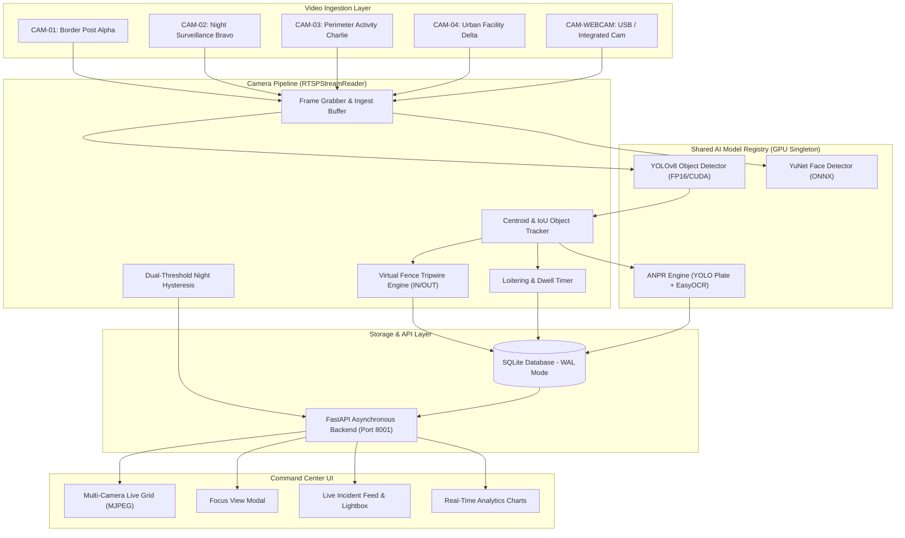

# PRAHARI-AI — Multi-Camera Intelligent Surveillance Platform

> **AI-powered multi-camera surveillance and perimeter security monitoring platform designed to transform ordinary video feeds into a real-time intelligent monitoring command center.**

---

## Overview

Modern perimeter security and facility surveillance systems struggle with severe operational constraints: vast physical zones, human operator fatigue from staring at passive monitors, delayed response times to breaches, manual logging bottlenecks, and nocturnal blindspots.

**PRAHARI-AI** (*Pra-ha-ri* — Sanskrit for *Sentinel / Guardian*) is an edge-native, real-time video analytics and surveillance monitoring system. It ingests multiple camera streams simultaneously, applies deep learning inference via a shared GPU architecture, tracks objects with persistent IDs, enforces virtual fence tripwires, detects nocturnal movement, flags loitering behaviors, extracts vehicle license plates (ANPR), and provides an interactive command center dashboard for security personnel.

---

## Problem & Solution

### The Problem
- **Operator Fatigue**: Human attention drops significantly within 20 minutes of continuous CCTV monitoring.
- **Passive vs. Active**: Traditional CCTV records crimes after they occur; it does not alert in real time.
- **Perimeter Breaches**: Security personnel cannot manually monitor all boundary tripwires 24/7.
- **Vehicle Tracking Bottlenecks**: Logging license plates at checkpoints manually is slow and error-prone.
- **Nighttime Vulnerability**: Low-light scenarios often mask perimeter intrusions.
- **Resource Inefficiency**: Running separate deep learning models per camera quickly exhausts GPU VRAM.

### The PRAHARI-AI Solution
- **Autonomous Multi-Camera Monitoring**: Processes 4 simultaneous surveillance feeds + live dynamic webcam input.
- **Active Real-Time Threat Alerts**: Instant visual alerts, directional classification (`IN`/`OUT`), and snapshot archiving upon breach.
- **Shared Model Registry**: Single GPU memory footprint (~250 MB VRAM) serving all concurrent streams without duplicate allocations.
- **Multi-Stage Security Logic**: Combines virtual tripwire fences, dwell-time loitering heuristics, and dual-threshold night detection.
- **Automated License Plate Recognition**: Detects vehicle plates and classifies them into structured confidence tiers.
- **Modern Tactical Command Center**: Live MJPEG video grid, instant focus mode, real-time telemetry, and SQLite-backed historical analytics.

---

## Key Features

- **Multi-Camera Grid & Dynamic Ingestion**:
  - Simultaneous processing of 4 core surveillance feeds:
    - **CAM-01**: *Border Post Alpha* (`demo_videos/border_demo.mp4`)
    - **CAM-02**: *Night Surveillance Bravo* (`demo_videos/night_demo.mp4`)
    - **CAM-03**: *Perimeter Activity Charlie* (`demo_videos/activity-demo.mp4`)
    - **CAM-04**: *Urban Facility Delta* (`demo_videos/cctv_demo.mp4`)
  - Dynamic hardware webcam integration as **CAM-WEBCAM** with one-click connect/disconnect.
- **Real-Time Object Detection**:
  - Ultralytics YOLOv8-powered object detection for persons and vehicles.
  - Subtype classification for **Cars**, **Motorcycles**, **Buses**, and **Trucks**.
- **Multi-Object Centroid Tracking**:
  - IoU and Euclidean distance matching with persistent track IDs.
  - Trajectory tracking and direction determination across consecutive frames.
- **Virtual Fence Intrusion Detection**:
  - Configurable geometric tripwire per camera.
  - Directional breach detection (`IN` vs `OUT`) with automated forensic snapshot capture.
- **Night Surveillance with Hysteresis**:
  - Ambient luminance estimation with dual-threshold hysteresis (`Enter: 85.0`, `Exit: 98.0`).
  - Distinguishes day and night conditions to alert on nocturnal movement.
- **Suspicious Activity & Loitering Analytics**:
  - Dwell-time monitoring tracking stationary targets exceeding spatial thresholds (>20 seconds within anchor radius).
- **Automated Number Plate Recognition (ANPR)**:
  - High-accuracy license plate localization paired with EasyOCR text extraction.
  - Structured validation categories: `VERIFIED`, `DETECTED`, `LOW_CONFIDENCE`, `NOT_READ`.
- **YuNet Face Detection (Detection-Only)**:
  - Lightweight ONNX-based face detection for head/upper-body regions.
  - *Privacy Guaranteed*: Strictly detection-only; **no** identity recognition, **no** biometric identification, and **no** facial database storage.
- **Shared GPU Model Registry**:
  - Singleton pattern (`ModelRegistry`) ensuring shared weights across all active readers.
  - Bounded VRAM footprint (<300 MB) with thread-safe inference concurrency.
- **Live Command Center & Telemetry**:
  - Real-time camera telemetry displayed as `Objects: TOTAL (PERSON_COUNT P, VEHICLE_COUNT V)` (e.g. `Objects: 15 (9P, 6V)`).
  - Stream metrics: AI FPS, Capture FPS, Daytime/Nighttime state, Face count, and Threat level indicator.
- **Focus View & Incident Inspection**:
  - High-definition single-camera Focus View with quick navigation.
  - Lightbox modal for detailed forensic review of captured intrusion and ANPR evidence snapshots.
- **SQLite WAL Persistence & Offline Sync**:
  - Thread-safe SQLite event logging with Write-Ahead Logging (WAL) mode.
  - Offline-first JSON export mechanism for field deployments.
- **Real-Time Analytics Dashboard**:
  - Direct SQL aggregate analytics displaying camera event breakdown, hourly breach distributions, and verified plate counts.

---

## System Architecture



---

## Feature Workflow

1. **Ingestion**: `CameraManager` initializes independent `RTSPStreamReader` instances for configured streams and webcams.
2. **Inference**: Frames are passed through the singleton `ModelRegistry` (YOLOv8 + YuNet) on GPU/CUDA or CPU fallback.
3. **Tracking**: Bounding boxes are matched using IoU and centroid distance, maintaining persistent track IDs and trajectories.
4. **Boundary Evaluation**: The virtual fence state machine evaluates boundary crossings and determines `IN` or `OUT` direction.
5. **Behavioral & Environmental Analysis**:
   - Dwell timer checks if an entity remains stationary within a radius for >20 seconds.
   - Ambient luminance is measured against dual hysteresis thresholds to flag night movement.
6. **License Plate Extraction**: Vehicle crops are sent to the asynchronous ANPR queue, localized, enhanced, read via OCR, and validated.
7. **Persistence**: Security alerts and plate reads are written to `prahari_events.db` in SQLite WAL mode.
8. **Dashboard Visualization**: FastAPI serves live MJPEG streams and telemetry endpoints to the browser command center at `http://localhost:8001`.

---

## Technology Stack

- **Backend Framework**: Python 3.10+ / [FastAPI](https://fastapi.tiangolo.com/) / [Uvicorn](https://www.uvicorn.org/)
- **Computer Vision**: [OpenCV](https://opencv.org/) (`cv2`), [NumPy](https://numpy.org/)
- **Deep Learning**: [Ultralytics YOLOv8](https://github.com/ultralytics/ultralytics) (PyTorch CUDA / FP16)
- **Face Detection**: [YuNet ONNX](https://github.com/opencv/opencv_zoo/tree/master/models/face_detection_yunet) (*Detection-only, libfacedetection*)
- **License Plate OCR**: [EasyOCR](https://github.com/JaidedAI/EasyOCR) + fine-tuned YOLO plate localization
- **Database**: SQLite3 (Thread-Safe WAL Mode + Schema Migrations)
- **Frontend / UI**: HTML5, Vanilla CSS3 (Custom Design System), Modern JavaScript (ES6+), [Lucide Icons](https://lucide.dev/)

---

## Project Structure

```text
PRAHARI-AI/
├── main.py                     # FastAPI application server & MJPEG streaming endpoints
├── camera_manager.py           # Multi-camera configuration & dynamic webcam manager
├── rtsp_stream.py              # Core RTSPStreamReader, ModelRegistry & AI pipelines
├── centroid_tracker.py         # Multi-object centroid & IoU tracking engine
├── anpr_engine.py              # License plate detection, OCR & validation pipeline
├── database.py                 # SQLite WAL database manager & analytics engine
│
├── templates/
│   └── index.html              # Command Center UI (Grid, Focus View, Lightbox, Analytics)
│
├── demo_videos/                # Pre-configured multi-camera surveillance demo video feeds
│   ├── border_demo.mp4         # CAM-01: Border Post Alpha
│   ├── night_demo.mp4          # CAM-02: Night Surveillance Bravo
│   ├── activity-demo.mp4       # CAM-03: Perimeter Activity Charlie
│   └── cctv_demo.mp4           # CAM-04: Urban Facility Delta
│
├── weights/                    # Pretrained AI model weights
│   ├── yolov8n.pt              # YOLOv8 nano object detection weights
│   └── face_detection_yunet_2023mar.onnx # YuNet face detection ONNX model
│
├── tests/                      # Automated unit and integration test suite
│   └── test_full_suite.py      # Comprehensive unittest verification suite
│
├── start_prahari.bat           # One-click Windows batch launcher
├── start_prahari.ps1           # Windows PowerShell launcher
├── requirements.txt            # Python package dependencies
├── .gitignore                  # Git repository exclusion rules
└── README.md                   # Project documentation
```

---

## Installation & Running

### Prerequisites
- **Operating System**: Windows 10/11 (or Linux)
- **Python**: Python 3.10, 3.11, or 3.12
- **GPU (Recommended)**: NVIDIA GPU with CUDA support (CPU fallback is fully supported)

### 1. Clone Repository
```bash
git clone https://github.com/abhishek-khairnar/PRAHARI-AI.git
cd PRAHARI-AI
```

### 2. Set Up Virtual Environment (Optional but Recommended)
```powershell
python -m venv venv
.\venv\Scripts\Activate.ps1
```

### 3. Install Dependencies
```bash
pip install -r requirements.txt
```

### 4. Start PRAHARI-AI Command Center

#### Option A: One-Click Windows Batch Launcher
Double-click `start_prahari.bat` or run:
```cmd
start_prahari.bat
```

#### Option B: PowerShell Launcher
```powershell
.\start_prahari.ps1
```

#### Option C: Direct Python Command
```bash
python main.py
```

The Command Center will be accessible at:
```text
http://localhost:8001
```

---

## Dynamic Webcam Module

PRAHARI-AI includes dynamic USB / integrated webcam management:

1. **Discovery**: Click **"Connect Webcam"** in the top navigation bar to probe connected camera hardware via `/api/webcams/available`.
2. **Activation**: Select the target device index (e.g. Device #0) to initialize `CAM-WEBCAM`.
3. **Shared Pipeline**: `CAM-WEBCAM` leverages the existing shared `ModelRegistry` without allocating duplicate GPU memory.
4. **Interactive Focus View**: Full support for single-camera Focus View and live snapshot inspection.
5. **Clean Shutdown**: Disconnect the webcam at any time using the **"Disconnect Webcam"** button without restarting the server.

---

## Performance & Hardware Benchmarks

| Metric | Measured Specification |
| :--- | :--- |
| **Test Environment** | NVIDIA GeForce RTX 3050 (6GB VRAM Laptop GPU) / Intel Core CPU |
| **GPU Memory Footprint** | ~250 MB total VRAM for all concurrent streams (via `ModelRegistry`) |
| **YOLOv8n Inference Time** | ~8–15 ms per frame on CUDA (FP16) |
| **YuNet Face Detection** | <2 ms amortized latency (periodic evaluation) |
| **Camera Ingest Throughput** | 25–30 FPS capture rate across 4 simultaneous 1080p/720p streams |
| **Database Write Latency** | <1 ms (SQLite WAL mode with background connection pools) |

> [!NOTE]
> Performance depends on input stream resolution, host hardware, CUDA availability, and the number of active AI processing modules.

---

## Privacy & Responsible AI Disclosure

- **Detection-Only Architecture**: Face detection in PRAHARI-AI is strictly detection-only (identifying bounding boxes in the frame).
- **No Identity Recognition**: The system does **not** perform facial recognition, identity matching, or biometric profiling.
- **No Biometric Database**: No facial images, embeddings, or biometric identity databases are created, indexed, or stored.
- **Regulatory Compliance**: Deployments should adhere to applicable local data privacy, surveillance, and security regulations.

---

## Automated Test Suite

PRAHARI-AI includes a comprehensive test suite covering database persistence, ModelRegistry singleton integrity, CameraManager stream lifecycle, night hysteresis thresholds, and FastAPI endpoints.

Run the test suite with:
```bash
python tests/test_full_suite.py
```

Expected output:
```text
Ran 8 tests in 7.005s

OK
```

---

## License

This project is licensed under the MIT License — see the repository for complete details.
